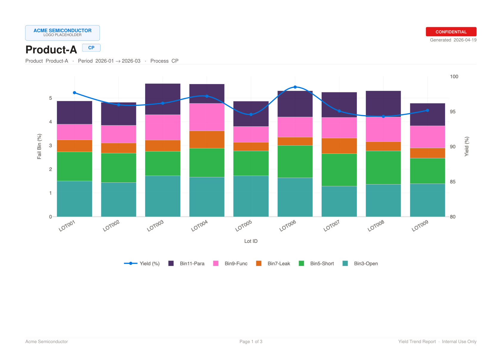

# Yield Trend Report Generator

半導体プロダクトエンジニア向けの Yield Trend レポート作成 Web ツール。  
Oracle DB から Wafer 単位データを取得し、Lot 毎に集計。CP / FT / SLT の複合チャート（Yield 折れ線 + 不良 Bin Stacked Bar）を Web 表示・PDF 出力します。

---

## スクリーンショット

### Web UI


### 出力 PDF（1 ページ目）


---

## 主な機能

| 機能 | 詳細 |
|------|------|
| 製品 / 期間 / 工程フィルター | Product ドロップダウン、開始〜終了月、CP / FT / SLT チップ選択 |
| 複合チャート | Lot 平均 Yield 折れ線（右 Y 軸）+ 不良 Bin Stacked Bar（左 Y 軸） |
| Web プレビュー | Plotly でインタラクティブ表示（ズーム / ホバー / 凡例トグル） |
| PDF エクスポート | A4 横向き、企業ロゴ / CONFIDENTIAL 透かし / ページ番号付き |
| モックモード | Oracle 不要でモックデータで即起動 (`USE_MOCK_DATA=true`) |

---

## 技術スタック

### Frontend
- React 19 + TypeScript (Vite)
- react-plotly.js + plotly.js
- Notion 風デザイントークン（Inter フォント / warm-white / Notion Blue）

### Backend
- Python 3.13 + FastAPI + uvicorn
- oracledb（Oracle DB 公式 Python ドライバ）
- pandas（Wafer → Lot 集計）
- Plotly + kaleido（PDF 用チャート画像生成）
- ReportLab（A4 横 PDF 組み立て）

---

## ディレクトリ構成

```
Report_gen/
├── backend/
│   ├── app/
│   │   ├── main.py             # FastAPI アプリ本体・CORS 設定
│   │   ├── config.py           # 環境変数読み込み（Settings クラス）
│   │   ├── database.py         # Oracle 接続プール管理
│   │   ├── models/
│   │   │   └── schemas.py      # Pydantic スキーマ
│   │   ├── routers/
│   │   │   ├── yield_data.py   # GET /api/products, POST /api/yield-data
│   │   │   └── export.py       # POST /api/export-pdf
│   │   └── services/
│   │       ├── yield_service.py  # データ取得・集計ロジック
│   │       └── pdf_service.py    # PDF 生成ロジック
│   ├── requirements.txt
│   └── .env                    # ← gitignore 済み（下記テンプレート参照）
├── frontend/
│   └── src/
│       ├── App.tsx
│       ├── index.css           # Notion デザイントークン（CSS 変数）
│       ├── api/client.ts       # axios API クライアント
│       ├── components/
│       │   ├── Sidebar.tsx     # フィルターパネル
│       │   ├── ReportView.tsx  # レポートメイン表示
│       │   ├── YieldChart.tsx  # 複合チャートカード
│       │   └── PlotlyChart.tsx # react-plotly.js CJS 互換ラッパー
│       └── types/index.ts      # TypeScript 型定義
└── docs/
    └── specs/                  # 設計ドキュメント
```

---

## クイックスタート

### 前提条件
- [uv](https://docs.astral.sh/uv/) (`curl -LsSf https://astral.sh/uv/install.sh | sh`)
- Node.js 18+
- （本番のみ）Oracle Instant Client

### 1. バックエンド起動

```bash
cd backend

# 依存パッケージ一括インストール（Python 3.13 の venv も自動作成）
uv sync

# モックデータで起動（Oracle 不要）
uv run uvicorn app.main:app --reload --port 8000

# または環境変数を明示して起動
USE_MOCK_DATA=true uv run uvicorn app.main:app --reload --port 8000
```

API ドキュメントは http://localhost:8000/docs で確認できます。

### 2. フロントエンド起動

```bash
cd frontend
npm install
npm run dev
```

ブラウザで http://localhost:5173 を開きます。

---

## 環境変数

`backend/.env` を作成して設定します（`.env.example` を参照）：

```env
# Oracle DB 接続（USE_MOCK_DATA=false のときのみ使用）
ORACLE_DSN=hostname:1521/SERVICE_NAME
ORACLE_USER=your_user
ORACLE_PASSWORD=your_password
ORACLE_MIN_CONNECTIONS=2
ORACLE_MAX_CONNECTIONS=10

# モックデータ切り替え（true = Oracle 不要）
USE_MOCK_DATA=true
```

> ⚠️ `.env` は `.gitignore` に含まれています。絶対に Git に追加しないでください。

---

## API エンドポイント

| メソッド | パス | 説明 |
|----------|------|------|
| `GET` | `/health` | ヘルスチェック |
| `GET` | `/api/products` | 製品一覧取得 |
| `POST` | `/api/yield-data` | Yield + Bin データ取得 |
| `POST` | `/api/export-pdf` | PDF バイナリ取得 |

### `POST /api/yield-data` リクエスト例

```json
{
  "product": "Product-A",
  "start_month": "2026-01",
  "end_month": "2026-03",
  "processes": ["CP", "FT", "SLT"]
}
```

---

## PDF カスタマイズ

`backend/app/services/pdf_service.py` 冒頭の定数を編集するだけで本番環境に対応できます：

```python
# ── 本番環境で差し替える箇所 ──────────────────────────────
COMPANY_NAME = "Acme Semiconductor"      # フッター左・ロゴ下テキスト
LOGO_PATH: str | None = None             # 企業ロゴ画像パス（None = テキストプレースホルダー）
CONFIDENTIAL = True                      # False にすると透かし・バッジを非表示
# ──────────────────────────────────────────────────────────
```

### ロゴ画像を使う場合

```python
LOGO_PATH = "/path/to/company_logo.png"  # PNG / JPEG 対応
```

ロゴは A4 横の左上（20mm × 12mm 以内）に自動フィットします。

---

## Oracle DB テーブル仕様

```sql
CREATE TABLE wafer_test_results (
    lot_id          VARCHAR2(20)   NOT NULL,
    wafer_id        VARCHAR2(20)   NOT NULL,
    product_name    VARCHAR2(50)   NOT NULL,
    test_process    VARCHAR2(10)   NOT NULL,   -- 'CP' / 'FT' / 'SLT'
    test_month      VARCHAR2(7)    NOT NULL,   -- 'YYYY-MM'
    yield_pct       NUMBER(6,3)    NOT NULL,   -- 例: 95.420
    gross_die       NUMBER(10)     NOT NULL,
    bin_code        VARCHAR2(20)   NOT NULL,   -- 例: 'Bin3-Open'
    bin_fail_count  NUMBER(10)     NOT NULL
);
```

> Wafer 単位で複数行（bin_code ごと）登録。アプリ側で Lot 毎に集計します。  
> Bin 不良率 = `bin_fail_count / gross_die × 100`

---

## 社内サーバーへのデプロイ

### バックエンド（systemd 例）

```ini
[Unit]
Description=Yield Trend Report API
After=network.target

[Service]
User=appuser
WorkingDirectory=/opt/yield-report/backend
Environment="USE_MOCK_DATA=false"
EnvironmentFile=/opt/yield-report/backend/.env
ExecStart=/opt/yield-report/backend/venv/bin/uvicorn app.main:app --host 0.0.0.0 --port 8000
Restart=always

[Install]
WantedBy=multi-user.target
```

### フロントエンド（静的ビルド）

```bash
cd frontend
npm run build          # dist/ に静的ファイル生成
# → nginx / Apache で dist/ を配信
```

### CORS 設定

`backend/app/main.py` の `allow_origins` に本番 URL を追加：

```python
allow_origins=[
    "http://localhost:5173",
    "https://your-internal-server.example.com",  # ← 追加
],
```

---

## ライセンス

社内利用限定。無断配布・外部公開禁止。
