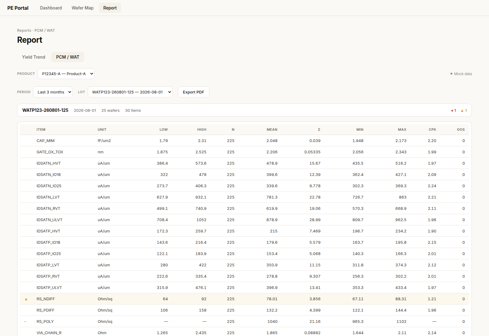
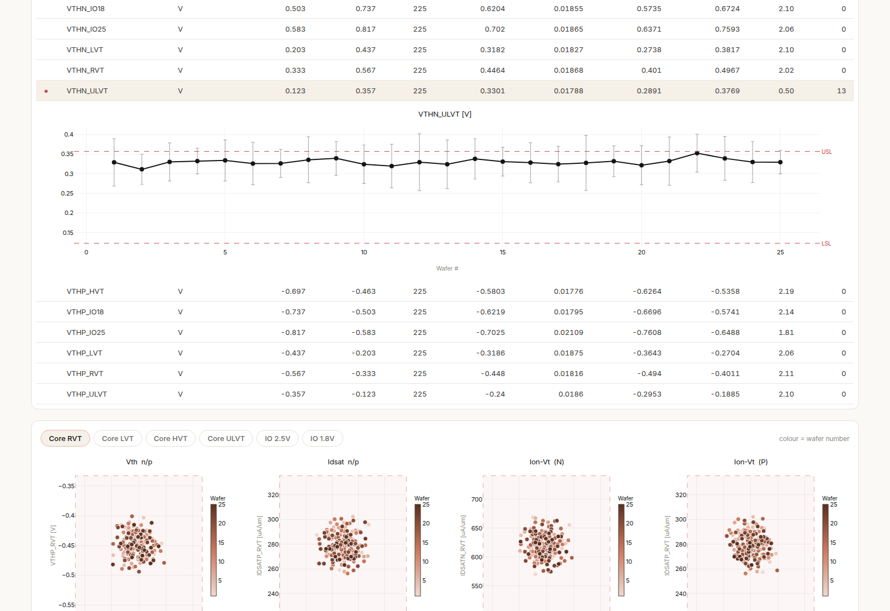
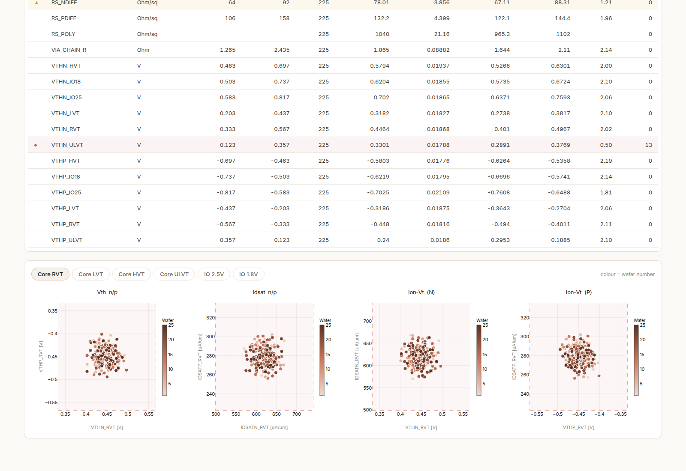
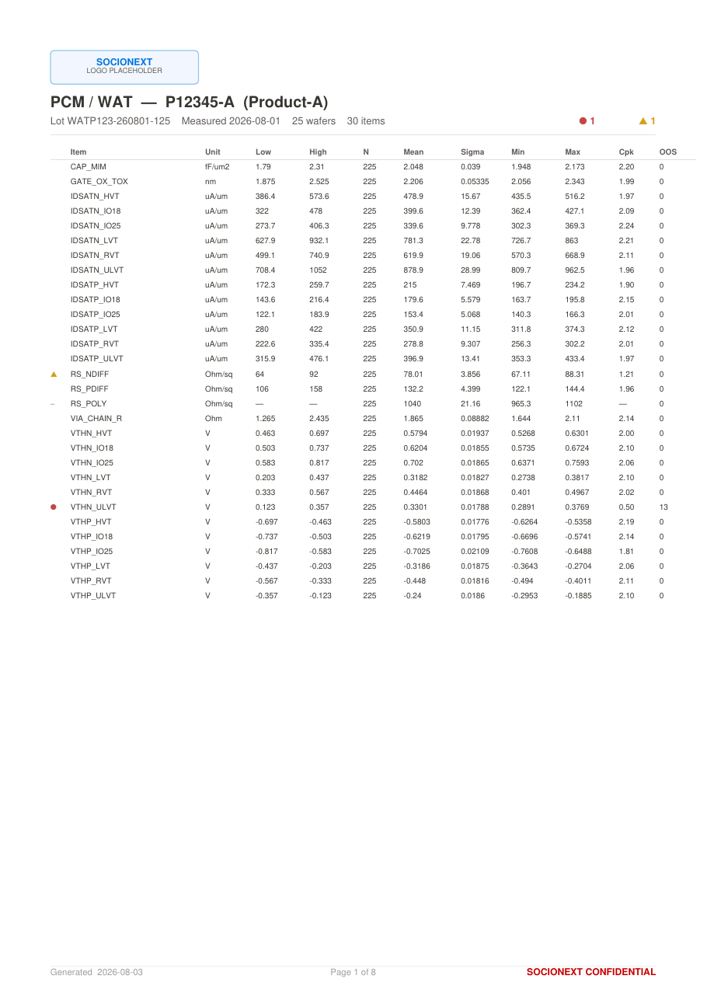
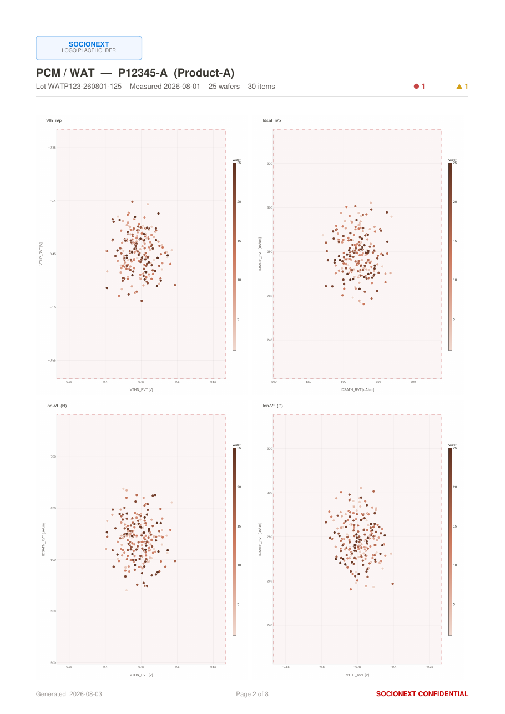

# PCM / WAT ロットサマリー — 実装サマリー

Report ページに追加した 2 つ目の機能。選択した **1 ロット**の WAT（パラメトリック測定）の出来栄えを確認し、報告用 PDF を出力する。

- 設計仕様: `docs/superpowers/specs/2026-07-28-pcm-wat-lot-summary-design.md`
- 実装計画: `docs/superpowers/plans/2026-07-28-pcm-wat-lot-summary.md`
- ブランチ: `feat/pcm-wat-lot-summary`（21 commits / 32 files / +3,204 −126）
- テスト: backend 183 passed、frontend `npm run build` / `npm run lint` ともに exit 0

---

## 1. 何ができるか

製品 → 期間 → ロットを選ぶと、そのロットについて次が出る。

| 表示 | 内容 |
| --- | --- |
| ロットヘッダ | ロット ID / 測定日 / ウェハ枚数 / 項目数 / 赤・黄の件数 |
| サマリーテーブル | 測定項目ごとの統計と判定（12 列） |
| ウェハ別トレンド | 行クリックでその項目のウェハ推移を直下に展開 |
| 散布図 | Vth/Idsat の n-p 相関と Ion-Vt を、デバイスフレーバー単位で 4 図 |
| PDF | 上記一式を A4 縦で出力 |

すべて**単一ロットに閉じる**。期間横断の集計は行わない。

---

## 2. 画面

### 2.1 サマリーテーブル



- 並びは `ITEM_NAME` 昇順の**固定順**。ロットが変わっても行位置が変わらないので、別ロットとの見比べができる
- 判定は**色と記号の両方**で示す（`●` 赤 / `▲` 黄 / `–` 規格未設定 / 無印 正常）。記号を併記しているのは、同じ表が PDF で白黒印刷される場合に色だけでは判定が消えるため
- 判定の色が付くのは**記号列だけ**。数値セルは常にインク色で、色の付いた数値を判定と読み違えないようにしている
- 数値は有効数字 4 桁。PDF 側と同じ整形規則（Python の `%.4g`）に揃えてある

上のスクリーンショットで読み取れる 3 状態:

| 項目 | Cpk | 規格外 | 判定 |
| --- | --- | --- | --- |
| `VTHN_ULVT` | 0.50 | 13 件 | `●` 赤 |
| `RS_NDIFF` | 1.21 | 0 件 | `▲` 黄 |
| `RS_POLY` | — | — | `–` 規格未設定 |

### 2.2 ウェハ別トレンド（行クリックで展開）



- 横軸はウェハ番号、点はそのウェハのサイト平均、ひげは ±3σ
- 規格上下限を破線＋ラベル（USL / LSL）で重ねる
- 単一系列なので凡例は出さない（タイトルが系列名を兼ねる）
- サイト数が 1 枚しかないウェハは σ を算出できないため、ひげを描かない（0 として描くと「ばらつきゼロ」に見えてしまう）

### 2.3 散布図



デバイスフレーバー（RVT / LVT / HVT / ULVT / IO 2.5V / IO 1.8V）ごとに 4 図:

| プロット | 横軸 | 縦軸 | 読み取れること |
| --- | --- | --- | --- |
| Vth n/p | Vth_n | Vth_p | N/P のバランス（対称性） |
| Idsat n/p | Idsat_n | Idsat_p | 駆動能力の N/P バランス |
| Ion-Vt (N) | Vth_n | Idsat_n | NMOS の性能トレードオフ |
| Ion-Vt (P) | Vth_p | Idsat_p | PMOS の性能トレードオフ |

- **1 点 = 1 ウェハ × 1 サイト**（25 × 9 ≒ 225 点）。同じウェハの同じ測定サイトで測った 2 項目を組にする。片方が欠測のサイトは点にしない
- 色はウェハ番号。**単一色相の濃淡グラデーション＋カラーバー**を使っている。ウェハ番号は順序を持つ量なので、25 個の離散色では読めず、虹色配色では順序を誤読するため
- 規格範囲を薄い矩形で重ねてある。点がここから食み出していれば一目で分かる
- 6 フレーバー × 4 図 = 24 図あるため、**チップで 1 フレーバーずつ切り替える**。24 図を同時に並べると 1 図が小さくなりすぎて 225 点もカラーバーも読めない
- 図の列数は画面幅に追随する（広い画面では 1×4、狭い画面では 2×2）

---

## 3. PDF（A4 縦）

`Export PDF` で出力。ロゴ・フッタ・CONFIDENTIAL 表記は既存の歩留り PDF と共通（`pdf_common.py`）。

構成は ①ロット情報＋要約 → ②サマリーテーブル → ③散布図 24 図（2×2 で 6 ページ）→ ④赤・黄項目のトレンド。モックの 30 項目・6 フレーバーで **8 ページ / 約 9〜11 秒**。

### 3.1 1 ページ目（テーブル）



### 3.2 散布図ページ



---

## 4. 判定ロジック

### 4.1 統計

母集団は**そのロットの生の測定値全件**（ウェハ × サイト）。`MEAS_DATA` が NULL の行は N から除外する。σ は標本標準偏差（`ddof=1`）。

規格外は `value < SPEC_LOW` または `value > SPEC_HIGH`。**規格値ちょうどは規格内**として扱う。

### 4.2 Cpk

JSON は `Infinity` を表現できないため、Cpk は**数値**と**状態**の 2 フィールドで返す。

| 状況 | `cpk` | `cpk_state` | 表示 |
| --- | --- | --- | --- |
| 両側規格 | `min((USL−μ)/3σ, (μ−LSL)/3σ)` | `value` | 小数 2 桁 |
| 片側規格のみ | その片側だけで算出 | `value` | 小数 2 桁 |
| 規格が両方 NULL | `null` | `undefined` | `—` |
| σ = 0 かつ全数規格内 | `null` | `infinite` | `∞` |
| σ = 0 かつ規格外あり | `null` | `undefined` | `—` |
| n < 2 | `null` | `undefined` | `—` |

### 4.3 判定

**上から順に評価し、最初に該当したものを採用する。**

| 順 | 判定 | 条件 | 記号 |
| --- | --- | --- | --- |
| 1 | 赤 | 規格外が 1 件以上、または（`cpk_state == "value"` かつ `cpk < 1.00`） | `●` |
| 2 | 黄 | `cpk_state == "value"` かつ `1.00 ≤ cpk < 1.33` | `▲` |
| 3 | グレー | `cpk_state == "undefined"` | `–` |
| 4 | 正常 | 上記以外（`infinite` を含む） | （無印） |

評価順を固定しているのは、`n < 2`（Cpk 算出不可）かつ規格外があるケースで「グレー」が「赤」を隠さないようにするため。**規格外の存在は常に赤を優先する。**

閾値は**未満**で判定する。`cpk == 1.00` は赤ではなく黄、`cpk == 1.33` は黄ではなく正常。

判定は**サーバ側で 1 箇所だけ**（`wat_service.py` の `CPK_RED` / `CPK_YELLOW`）計算し、画面も PDF もその結果の文字列を受け取るだけ。閾値が 2 箇所に散らないようにしてある。

---

## 5. データソース

Oracle テーブル `WAT_MEASURE_DETAIL`（既存の歩留りテーブルと同一 DB）。粒度は **製品 × ロット × ウェハ × サイト × 測定項目**で、規格値と単位をテーブル自身が持つ。

> **この工程は rework 運用がないため `REWORK_NEW` / `DEL_FLAG` でフィルタしない。**
> `SEMI_CP_*` 系では `REWORK_NEW = 0` を両テーブルに掛けることが必須だが（掛け忘れると fail bin が二重計上される）、その規約をここに持ち込むと**有効な行を落とす**。`wat_queries.py` の docstring と、SQL にこれらの語が出現しないことを確認するテストの両方で防いでいる。

`PRODUCT_ID` は `product_config.yaml` の `product_id` と同値。`%` ワイルドカードを含む場合は `LIKE` で引く。

---

## 6. 設定

散布図に使う項目名は製品ごとに違うため、`product_config.yaml` に対応表を持つ。

```yaml
product_a:
  display_name: Product-A
  product_id: P12345-A
  # …既存の bin_group / processes / report ブロック…
  wat:
    pairs:
      - label: Core RVT
        vth:   {n: VTHN_RVT,   p: VTHP_RVT}
        idsat: {n: IDSATN_RVT, p: IDSATP_RVT}
      - label: Core LVT
        vth:   {n: VTHN_LVT,   p: VTHP_LVT}
        idsat: {n: IDSATN_LVT, p: IDSATP_LVT}
```

`pairs` は宣言順に表示される。記述例は `backend/product_config.yaml.example` にもある。

**未設定・不整合時の挙動**（いずれも画面全体・PDF 全体を失敗させない）:

| 状況 | 挙動 |
| --- | --- |
| `wat:` ブロックが無い | 散布図セクションごと非表示。サマリーテーブルは通常どおり |
| 設定した `ITEM_NAME` が実データに無い | その図だけ「No data」。他 3 図は描画 |
| ロットに WAT データが無い | 「No WAT data for this lot」 |

なお、製品が Report ページに出るには `report:` ブロックが必要。`wat:` だけ書いても到達できない。

---

## 7. API

| メソッド | パス | 用途 |
| --- | --- | --- |
| `GET` | `/api/wat/lots?product_id=&months=1\|3\|6` | ロット一覧（新しい順） |
| `GET` | `/api/wat/summary?product_id=&lot_id=` | 項目別統計 ＋ ウェハ別系列 ＋ 散布図の点 |
| `POST` | `/api/wat/export-pdf` | PDF（body: `{product_id, lot_id}`） |

ウェハ別系列と散布図の点を summary に**同梱**している。別エンドポイントに分けるとドリルダウンのたびに往復が増え、かつ PDF 側でも同じ系列が要るため**計算経路が 2 本に分岐**する。同梱すれば経路が 1 本に保たれ、画面と PDF の数値一致が構造的に保証される。

---

## 8. ファイル構成

**バックエンド（新規）**

| ファイル | 責務 |
| --- | --- |
| `app/services/wat_queries.py` | SQL 組み立てと実行 → DataFrame |
| `app/services/wat_service.py` | 統計集計・判定・散布図ペアリング・モック分岐 |
| `app/services/wat_pdf_service.py` | A4 縦 PDF 生成 |
| `app/services/pdf_common.py` | 両 PDF 共通のブランディング / フッタ / ファイル名生成 |
| `app/routers/wat.py` | エンドポイント 3 本 |

**バックエンド（変更）**: `product_config.py`（`wat:` 読み出し）/ `mock_data.py`（WAT モック）/ `schemas.py` / `pdf_service.py`（共通部品を import）/ `main.py`

**フロントエンド（新規）**

| ファイル | 責務 |
| --- | --- |
| `components/wat/WatSummaryTab.tsx` | タブ全体（ロット選択・取得・レイアウト） |
| `components/wat/WatSummaryTable.tsx` | 項目別テーブルと行展開 |
| `components/wat/WatItemTrendChart.tsx` | ウェハ別トレンド |
| `components/wat/WatScatterGrid.tsx` | フレーバー切替 + 散布図 |
| `ui/format.ts` | `fmtValue` / `fmtCpk`（PDF 側と同じ整形規則） |

**フロントエンド（変更）**: `ReportPage.tsx`（タブ追加のみ、歩留りロジックは不変）/ `api/client.ts` / `types/index.ts` / `theme.ts`

---

## 9. モックモード

`USE_MOCK_DATA=true`（既定）で Oracle なしに全機能が動く。6 フレーバー分の Vth/Idsat ＋ その他項目で 30 項目、25 ウェハ × 9 サイト。

**規格外の測定値と低 Cpk の項目を意図的に仕込んである**（`VTHN_ULVT` が赤、`RS_NDIFF` が黄）。赤・黄の描画、判定記号、PDF の「要注意項目だけチャートを載せる」ロジックを実 DB なしで検証するため。6 製品 × 20 ロットの走査で、全ロットに赤 1 件・黄 1 件が現れ、それ以外の項目は判定されないことを確認している。

---

## 10. 実 DB で最初に確認すべきこと

自動テストはモックのみを対象にしている。実データで最初に問題になりやすい順:

1. **`product_id` の `%` ワイルドカード** — `LIKE` 対応済み。ロット一覧が空になる場合はここを疑う
2. **`ITEM_NAME` の空白パディング** — `CHAR` 列由来だと `wat:` の項目名と一致せず全散布図が「No data」になる。クエリ境界で `strip` 済み
3. **`MEAS_DATA` の `Decimal` 型** — object dtype になると `std(ddof=1)` が落ちる。`pd.to_numeric` で数値化済み
4. **日本語・記号を含む `LOT_ID`** — PDF のファイル名は ASCII フォールバック＋RFC 5987 の 2 本立てにしてある

---

## 11. 既知の制約・今後の課題

- **エラーバウンダリが無い** — アプリ全体（Dashboard / Explore / Wafer Map / Report）に 1 つも無く、チャートが例外を投げるとタブが白くなる。本機能で 4 つチャート面が増えたので、アプリ全体を対象にした別タスクとして起票するのが妥当
- **PDF は同期生成**（約 9〜11 秒） — 同時実行数が増えると kaleido のセッションがその数だけ立つ。想定利用者数では問題ないが、デプロイ手順に注記しておくとよい
- **期間指定は `months × 30 日`** — 暦月ではないため、「直近 6 ヶ月」は 180 日を意味する
- 規格外の点そのものにラベルを振る処理は未実装（仕様には記載があった）
- `README.md` の API 一覧は未更新（`wafer_map` も未記載のため、既存の状態に倣っている）
